# 一、引言

web服务器：写的网站在web服务器上运行，相当于容器。如tomcat

# 二、tomcat

## 1.基本使用

- 先看的maven


### 1.启动

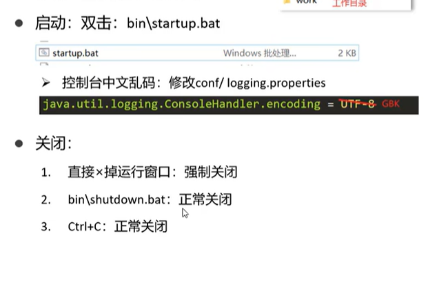

正常关闭比较好，涉及资源释放

### 2.修改配置

- 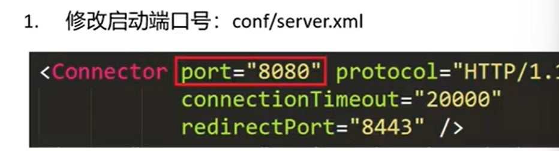
- 如果打不开，原因可能是**没启动tomcat**。而且修改了之后需要重新启动tomcat。
- tomcat是用java写的，所以电脑要配置java_home

### 3.部署项目

把文件夹or war包复制到webapps里

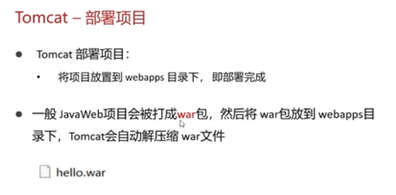

### 4.IDEA中创建maven web 项目


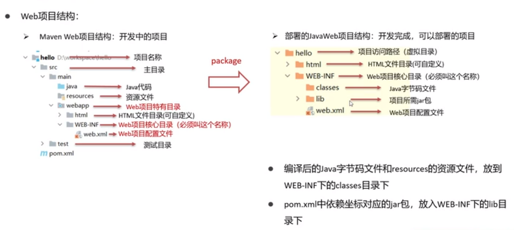

#### 4.1用骨架建

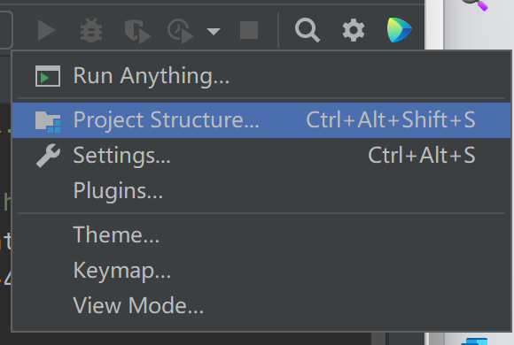

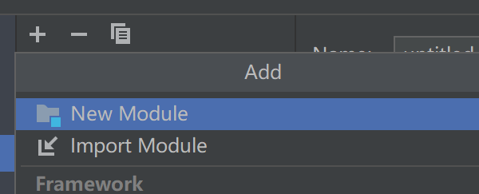

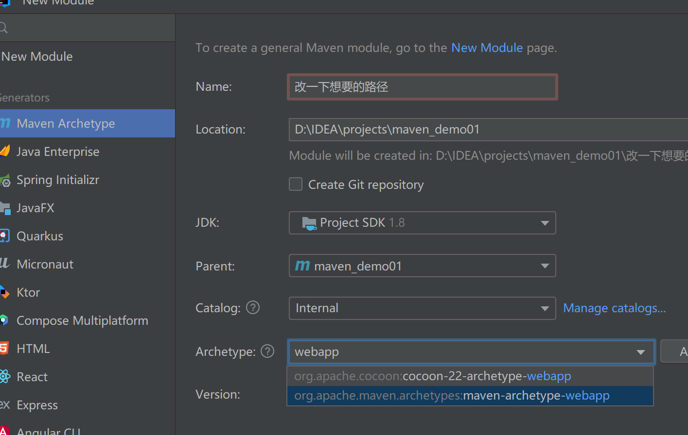

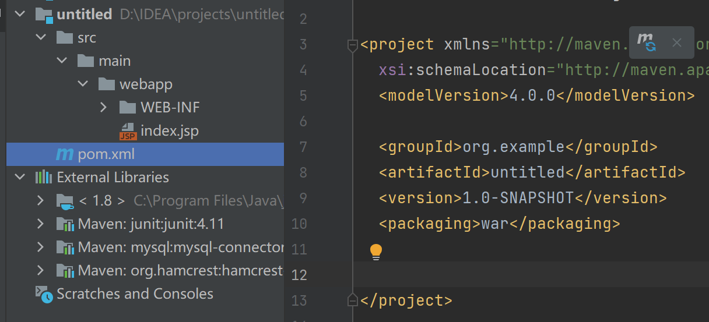

```html
<packageing>war</packaging>
*war：web项目打包方式
*默认是jar
```

#### 4.2不用骨架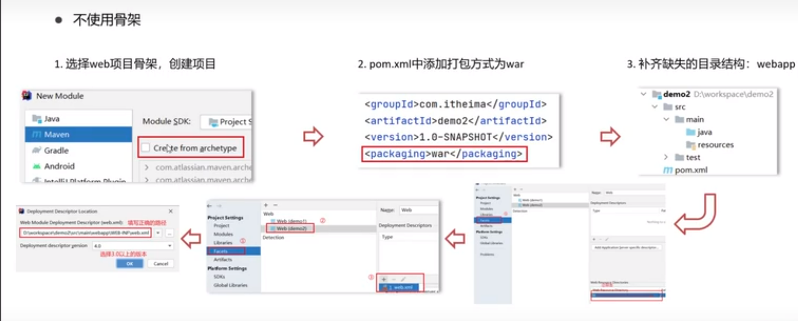


### 5.IDEA中使用tomcat＋部署项目(集成本地)

配置tomcat

- 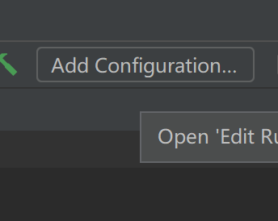
- 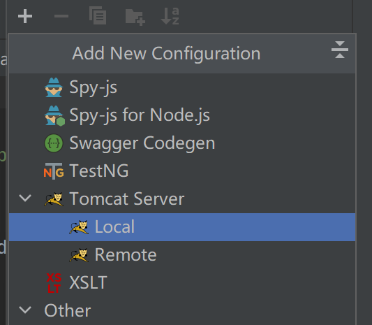
- server自己选下载目录


部署项目到tomcat上

- 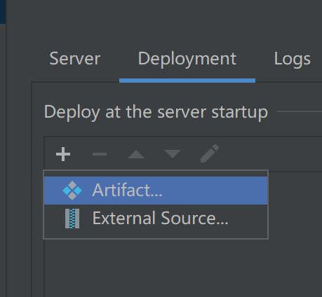

- 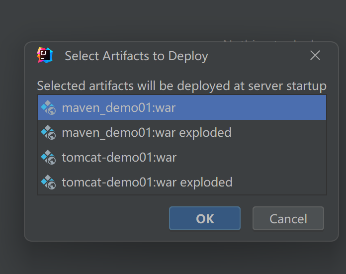
- 最后部署失败，，因为名字里有下划线，然后我就把已经部署的项目全去掉了，只加了新创建的项目

启动项目

- 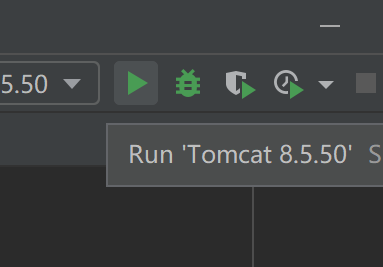
- 自动访问到这个地址：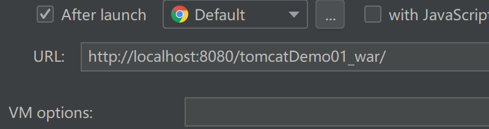
- 在地址栏输入相对路径a.html即可访问a.html：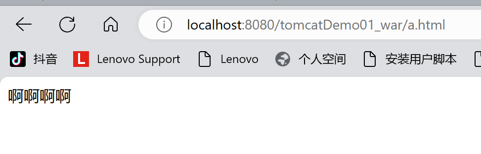

### 6.IDEA中用tomcat-maven插件部署项目

- ```html
  //pom.xml中
  <build>
      <plugins>
        <plugin>
          <groupId>org.apache.tomcat.maven</groupId>
          <artifactId>tomcat7-maven-plugin</artifactId>
          <version>2.2</version>
        </plugin>
        </plugins>
     </build>
  ```

- 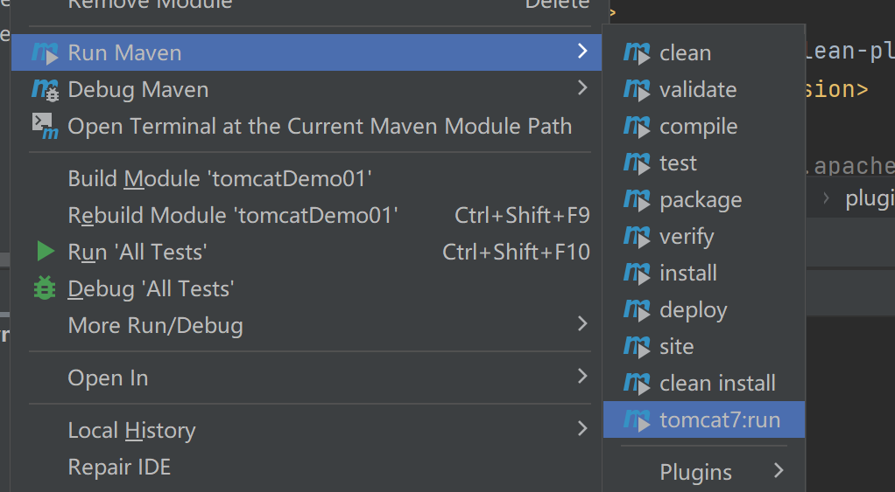

- 如果右键没有"tomcat7:run"，[Maven Helper插件右键没有tomcat7:run 的解决方法_灵sa的博客-CSDN博客](https://blog.csdn.net/qq_48842471/article/details/128524227)

  

## 2.maven

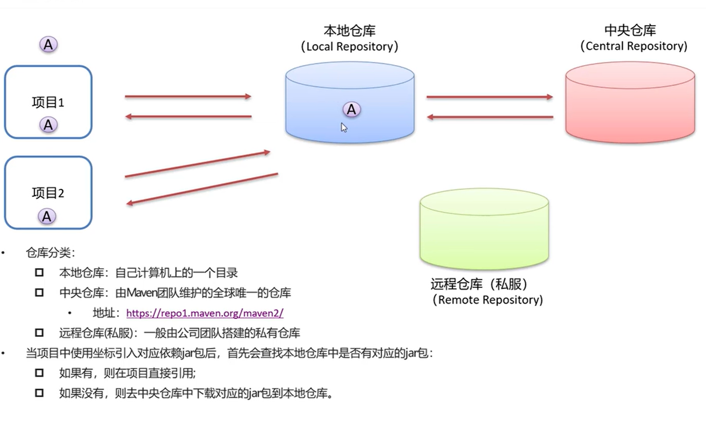

### 1.maven默认的仓库地址

因为在c盘，所以最好自己建一个


### 2.常用命令"mvn xxx"

- compile：编译
- clean：清理 删除target文件夹
- test：测试
- package：打包 在target文件夹中
- install：安装  下载到本地仓库文件夹

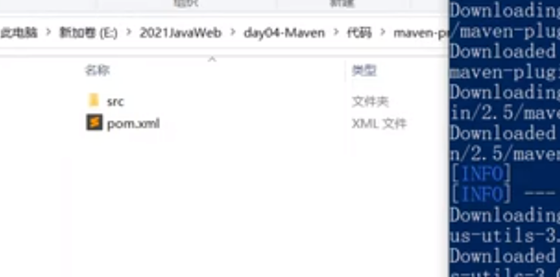

在项目目录下用命令

### 3.maven生命周期

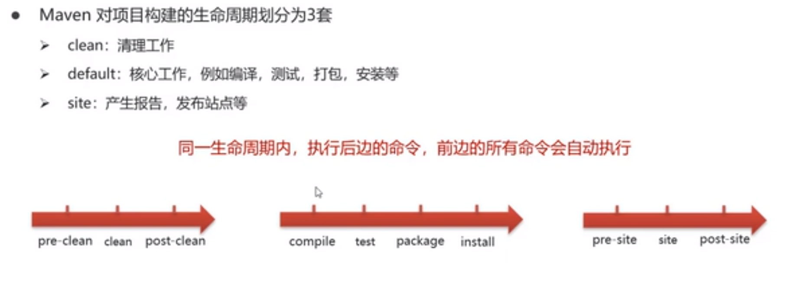

**同一生命周期内**，才会在执行后便命令时自动把本声明周期内前边的也执行了。E.G.执行install时，会自动执行compile,test,package（体现为多了targe文件夹&jar包等等


### 4.IDEA配置maven

坐标

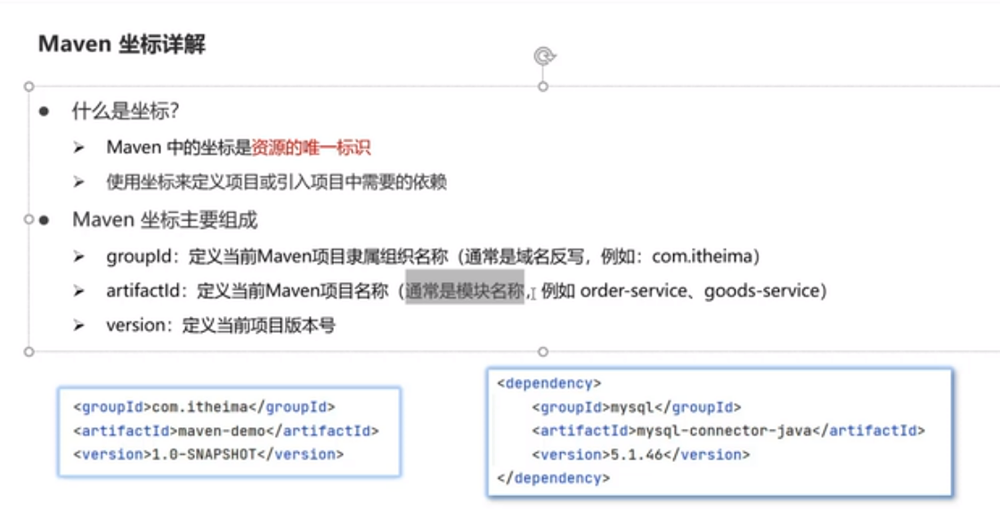

2022版创建maven项目：

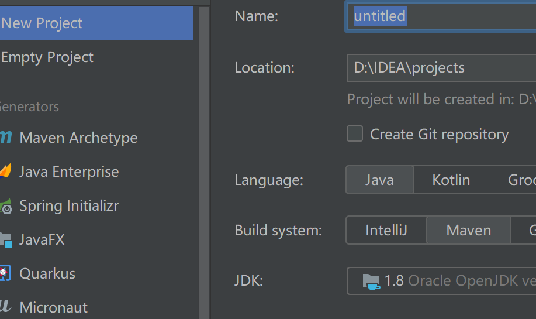

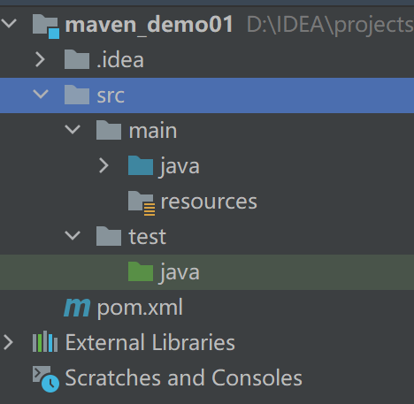


导入maven文件：

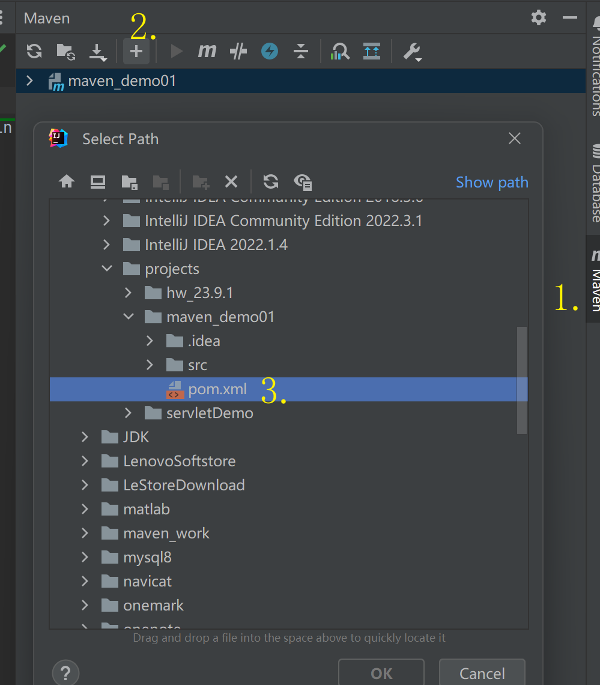


### 5.依赖管理

导包：

在pom.xml中写<u>**依赖坐标**</u>（就不用自己导包了）

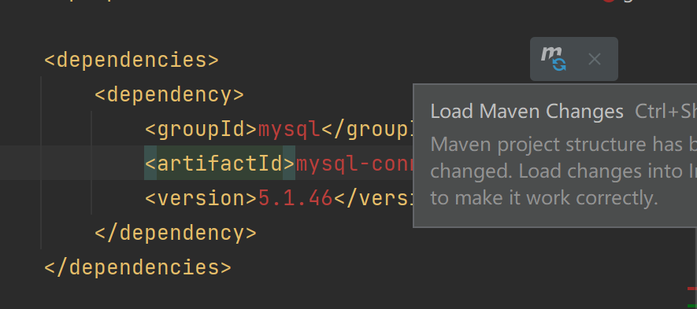

点刷新开始下载【写完or删完刷新】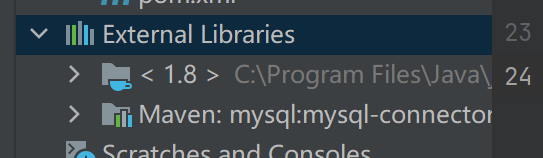

------

依赖范围：

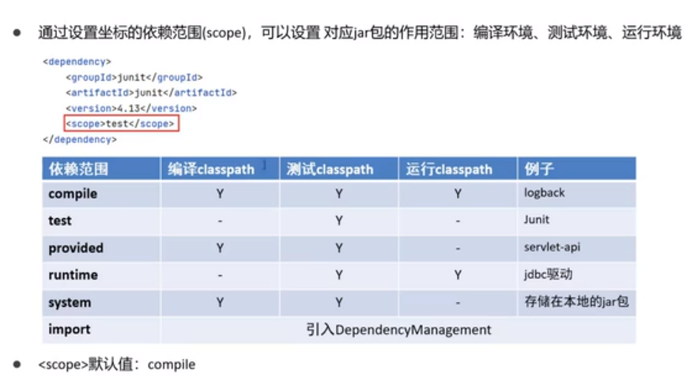


# 三、servlet

## 1.概念

- 运行在服务器端的小程序。servlet是一个<u>接口</u>，定义了Java类被浏览器访问（tomcat识别）的规则
- 是javaEE规范之一（规范=>接口）
- 定义servlet类实现servlet接口，并由web服务器运行servlet
- 由tomcat创建，调用
- **看javaEE文档**
- 学java看JDK文档

## 2.快速入门

1.创建web项目

- 打开IDEA->用骨架建【之前学的】

- 部署，tomcat-maven插件【之前学的】

  ```
  <build>
      <plugins>
        <plugin>
          <groupId>org.apache.tomcat.maven</groupId>
          <artifactId>tomcat7-maven-plugin</artifactId>
          <version>2.2</version>
        </plugin>
        </plugins>
     </build>
  ```

- 【新内容】**导入servlet依赖**

  ```html
  
      <dependency>
        <groupId>javax.servlet</groupId>
        <artifactId>javax.servlet-api</artifactId>
        <version>3.1.0</version>
        <scope>provided</scope>
      </dependency>
  ```

  -  <scope>**provided**</scope>作用范围仅在编译、测试时。

2. 定义一个类，**实现Servlet接口**，并重写方法
   - <u>ctrl+o:重写父类方法</u>

  

3.在类上方使用@WebServlet注解，配置该Servlet的访问路径

4.启动项目 并通过3中的路径访问

```java
mport javax.servlet.*;
import javax.servlet.annotation.WebServlet;
import java.io.IOException;
/***
 * servlet快速入门
 * ①导坐标：在pom.xml中加依赖，maven替人导包
 * ②重写接口所有方法
 * ③写访问路径
 * */


//注解,写访问路径
@WebServlet("/servlet01")
public class myServlet implements Servlet {//ctrl+o重写父类方法
    @Override
    public void init(ServletConfig servletConfig) throws ServletException {

    }

    @Override
    public ServletConfig getServletConfig() {
        return null;
    }

    @Override
    public void service(ServletRequest servletRequest, ServletResponse servletResponse) throws ServletException, IOException {
        System.out.println("hello");//Servlet接口被访问时，service()会自动执行
    }

    @Override
    public String getServletInfo() {
        return null;
    }

    @Override
    public void destroy() {

    }
}

```


p.s若文件夹中无法new JAVA class，可右键

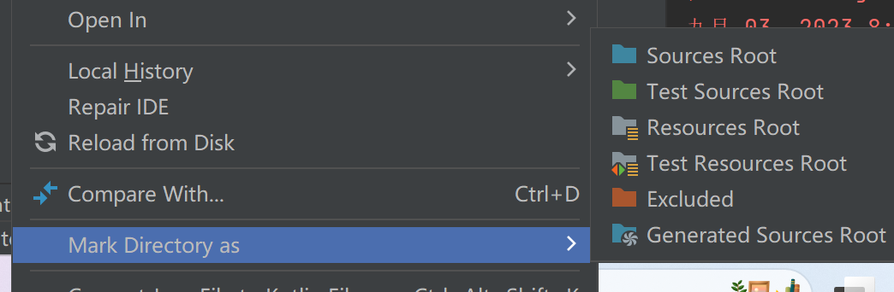

## 3.执行流程

servlet对象由web服务器创建，并调用方法。

## 4.生命周期

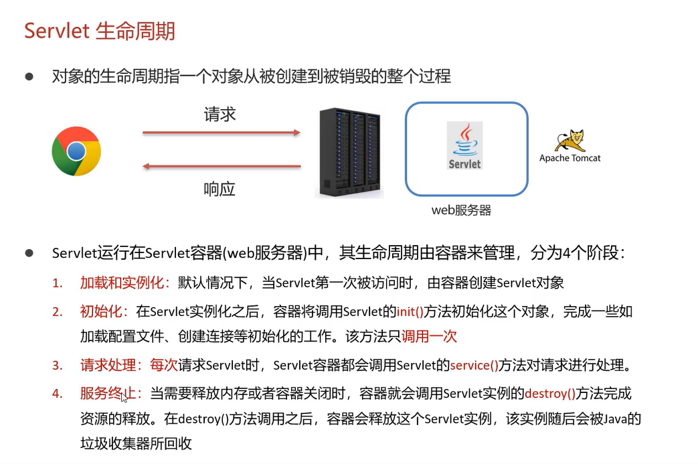

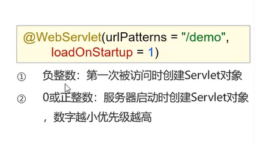

- ②相当于提前了servlet对象创建的时间


```java
import javax.servlet.*;
import javax.servlet.annotation.WebServlet;
import java.io.IOException;

@WebServlet(name = "ServletDemo01", value = "/sy")
//value==urlPatterns访问路径
public class servletDemo01 implements Servlet {
    
    /**
     * 初始化方法
     * 1.调用时机：默认情况下，servlet第一次被访问的时候，创建对象并初始化
     * 2.一次
     * */
    @Override
    public void init(ServletConfig servletConfig) throws ServletException {
        System.out.println("--init--");
    }


    /**
 * 提供服务
 * 1.调用时机：每次请求servlet时都会调用
 * */
    @Override
    public void service(ServletRequest servletRequest, ServletResponse servletResponse) throws ServletException, IOException {
        System.out.println("***service****");
    }


    /**
     * 提供服务
     * 1.调用时机：内存释放或服务器关闭时，servlet对象会被销毁，调用destroy释放资源
     * 2.一次
     * */
    @Override
    public void destroy() {
        System.out.println("***service****");
    }
}
```

运行结果：按照“/sy”路径访问时（且刷新只调用了service，**init只调用一次**）

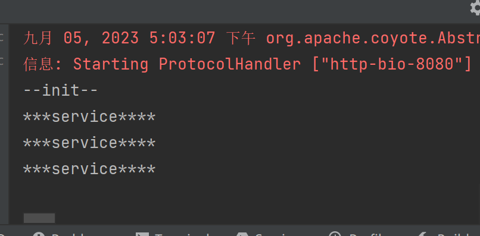

销毁：需要正常关闭-->ctrl+c

- 利用terminal启动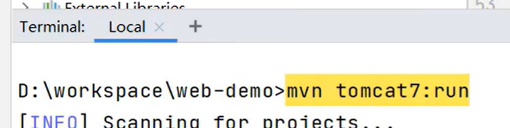
- ctrl+c结束 -->调用destroy

## 5.servlet方法

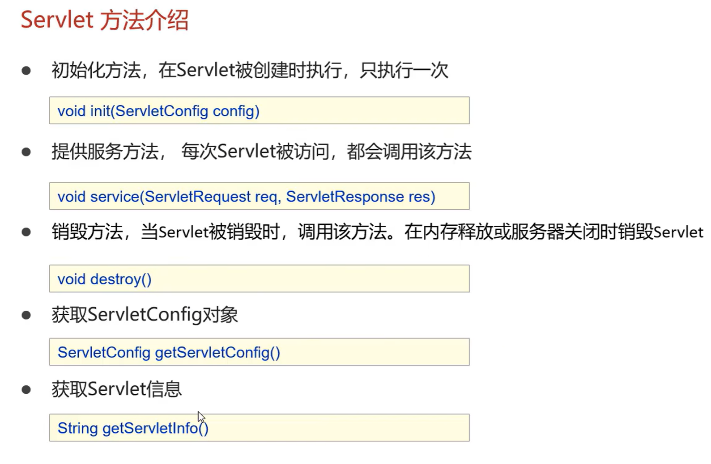

```java
@Override
    public ServletConfig getServletConfig() {
        return null;
    }

    @Override
    public String getServletInfo() {
        return null;
    }
```

- 观察可知getServletConfig()返回一个ServletConfig类，且init()形参里有ServletConfig类----》**想在getServletConfig()里直接用init()类里的局部变量**--------》**扩大其作用域**
- - `定义私有成员config`
  - 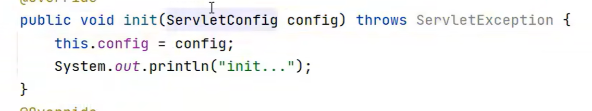用形参给私有成员config赋值
  - 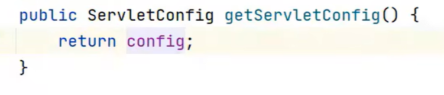返回私有成员

## 6.servlet体系结构

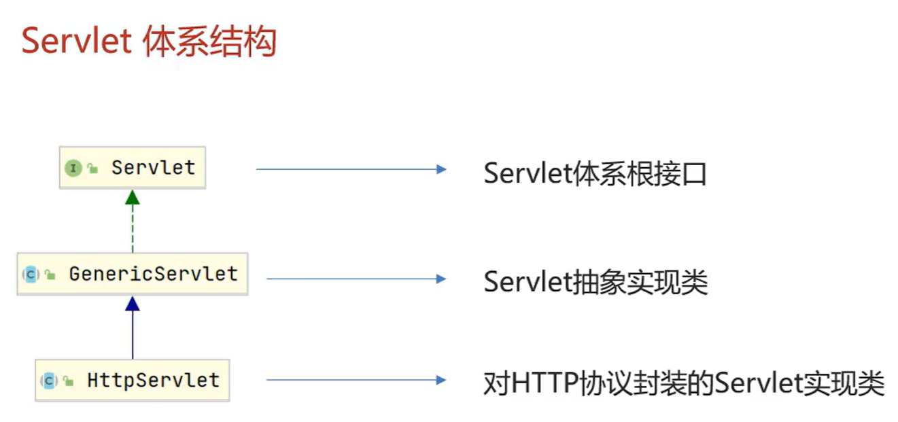

- 开发B/S架构的web项目，都是针对HTTP协议，所以自定义**继承HttpServlet**的Servlet类


get：


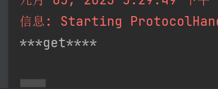

post：

①写了个表单利用post方式发送

```html
<html>
<body>
    <form action="http://localhost:8080/servlet02/Demo02" method="post">
        <input name="username">
        <input type="submit">
    </form>

</body>
</html>
```

②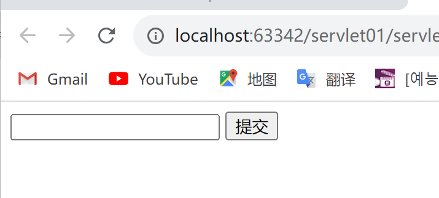

③随便写点点提交后，以post的方式访问demo02了。控制台：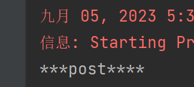


urlPatterns匹配方式

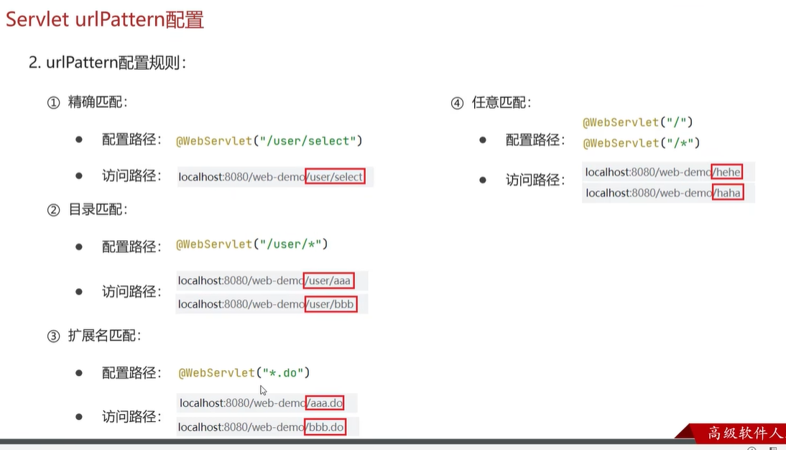


## 7.request


### 7.1request继承体系

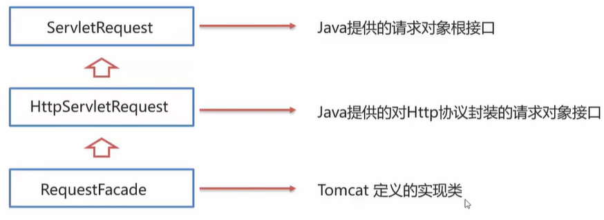

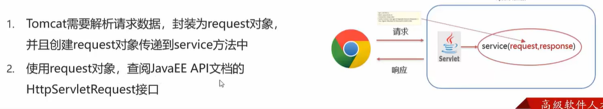

### 7.2获取请求数据

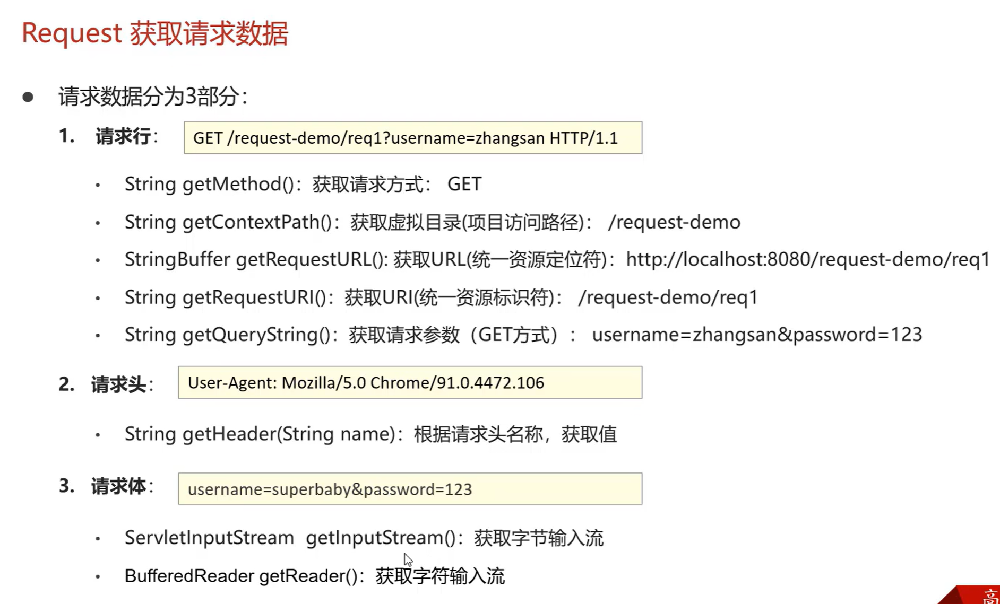

- get方式获取请求参数：用getQueryString()

- post方式用输入流

- request***通用的请求参数方法***①(在**doPost,doGet都能用**)

  - 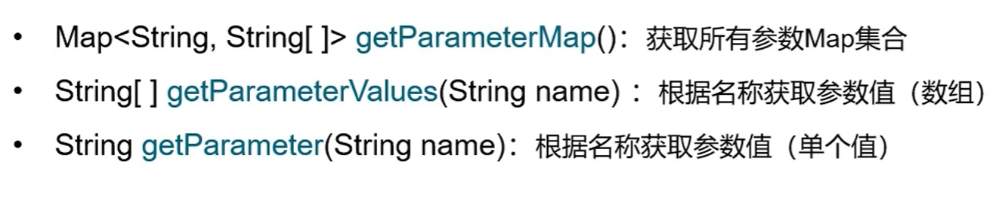
  - 参数是形如“username=lihua&hobby=1&hobby=2”的形式。request把各个分离出来，利用map**集合**(key，value)存储，key数据类型为string，value类型为string[]
  - 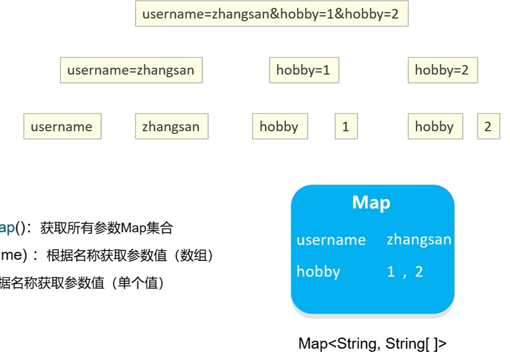

  

1.getParameterMap()

```java
/****
         * getParameterMap
         */
        Map<String,String[]> map=request.getParameterMap();
        //遍历
        for(String key:map.keySet()){
            System.out.println(key);

            String values[]=map.get(key);//String[]
            for(String val:values){
                System.out.print(val+" ");
            }

            System.out.println();
        }
```

```html
<html>
<body>
<form action="http://localhost:8080/servlet02/Demo03" method="get">
    <input name="username">
    <input type="checkbox" name="hobby" value="1">music
    <input type="checkbox" name="hobby" value="2">kpop
    <input type="submit">
</form>
</body>
</html>
```

流程：访问a1.html,提交后terminal显示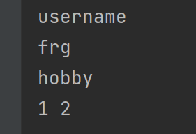

2.根据key返回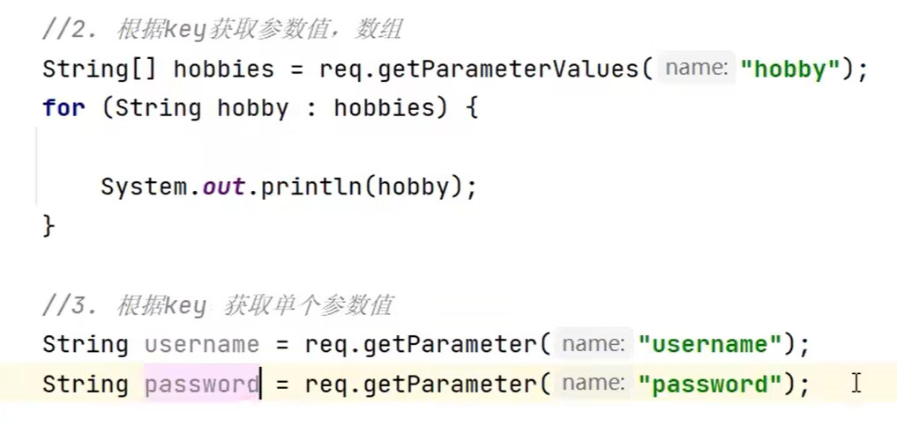

- get、post**通用请求参数方法②**
  - 在doPost中调用doGet
  - 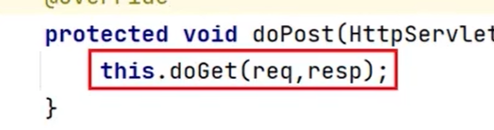

### 7.3请求转发

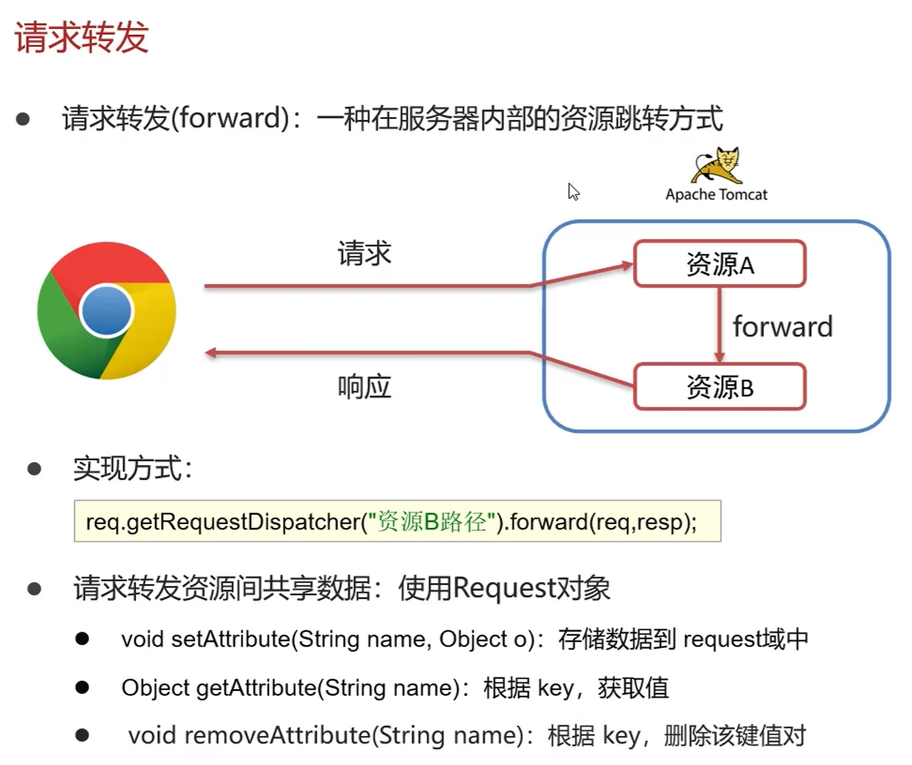

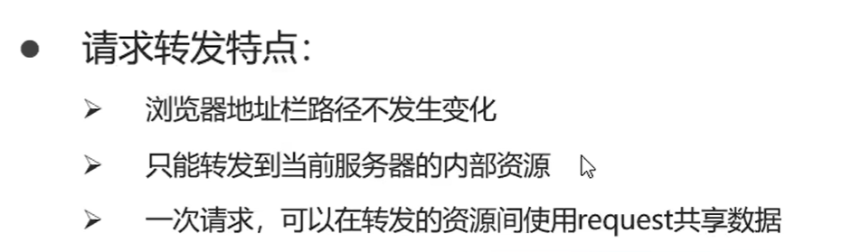


## 8.请求参数中文乱码

### 8.1GET

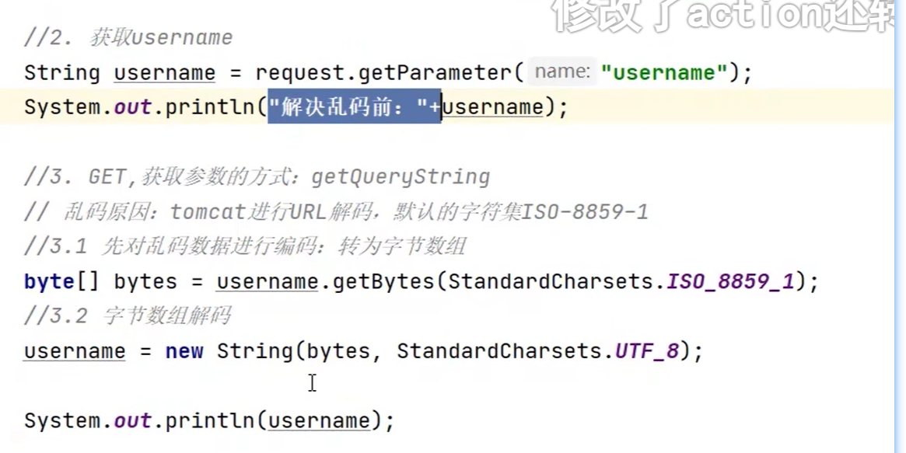

### 8.2POST

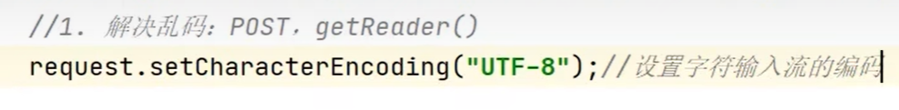

**<u>历史遗留问题：</u>**

应该第一行乱码，第二行汉字，但terminal两行一样，且都是不认识的字符，也没搜出来是什么编码方式。。。。。

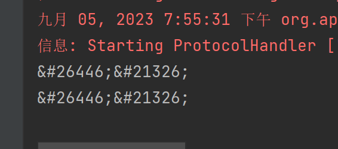

a1.html

```html
<html>
<body>
<form action="http://localhost:8080/servlet02/Demo04" method="get">
    <input name="username">
    <input type="checkbox" name="hobby" value="1">music
    <input type="checkbox" name="hobby" value="2">kpop
    <input type="submit">
</form>
</body>
</html>
```

```java
import javax.servlet.*;
import javax.servlet.http.*;
import javax.servlet.annotation.*;
import java.io.IOException;
import java.nio.charset.StandardCharsets;

@WebServlet(name = "ServletDemo4luanMa", value = "/Demo04")
public class ServletDemo4luanMa extends HttpServlet {
    @Override
    protected void doGet(HttpServletRequest request, HttpServletResponse response) throws ServletException, IOException {
        String username=request.getParameter("username");
        System.out.println(username);
        //1.把已知的乱码(iso_xxx编码)转换成二进制
        byte[] bs =username.getBytes(StandardCharsets.ISO_8859_1);
        //2.二进制转字符串，new时用字节数组做参数
        String s=new String(bs,StandardCharsets.UTF_8);
        System.out.println(s);
    }

    @Override
    protected void doPost(HttpServletRequest request, HttpServletResponse response) throws ServletException, IOException {

    }
}

```

## 9.reponse

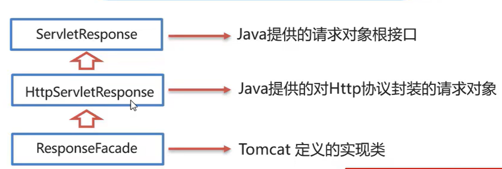

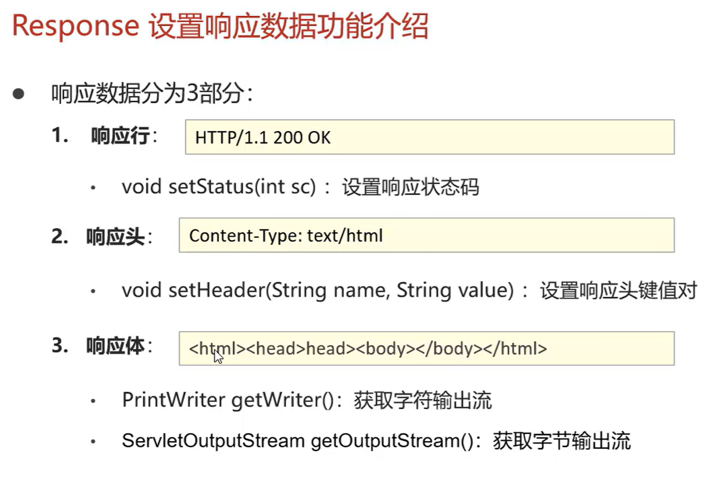

# 三、myBatis

## 1.简介

- 一款持久层框架，用于简化JDBC开发
  - 持久层：连接数据库的那层代码
  - javaEE三层架构：表现层、业务层、持久层


## 2.快速入门案例

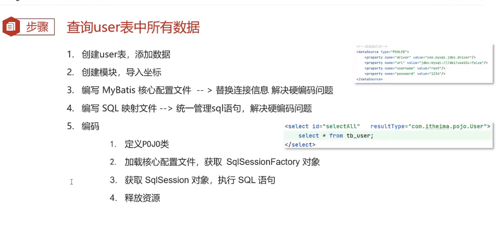

- 1.用的navicat创建了tb_user表，并插入了数据。

  - 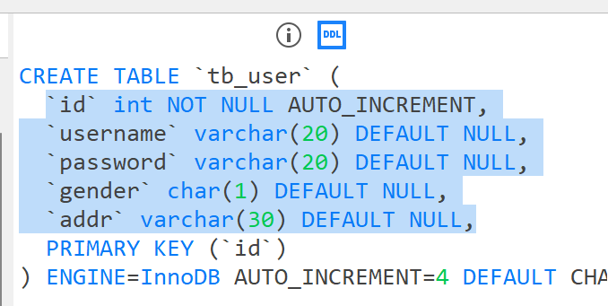
  - 点上边“DDL”可查看当时创建时的sql（虽然被魔改了

- 2.创建maven项目，pom.xml中各种导依赖

  - ```xml
    <dependencies>
        <dependency>       <groupId>org.mybatis</groupId>
            <artifactId>mybatis</artifactId>
            <version>3.5.6</version>
        </dependency>
        <dependency>
            <groupId>mysql</groupId>
            <artifactId>mysql-connector-java</artifactId>
            <version>5.1.46</version>
        </dependency>
        <!--junit单元测试-->
        <dependency>
            <groupId>junit</groupId>
            <artifactId>junit</artifactId>
            <version>3.8.2</version>
            <scope>test</scope>
        </dependency>
    ```

- 3.<u>**resources目录下建**</u>mybatis核心配置文件(mybatis-config.xml)【从官网复制的，然后把property改成自己的信息--数据库连接信息】

  - 一改property

  - 二改mappers【加载sql映射文件(别的xml)】

  - ```xml
    <?xml version="1.0" encoding="UTF-8" ?>
    <!DOCTYPE configuration
            PUBLIC "-//mybatis.org//DTD Config 3.0//EN"
            "https://mybatis.org/dtd/mybatis-3-config.dtd">
    <configuration>
        <environments default="development">
            <environment id="development">
                <transactionManager type="JDBC"/>
                <dataSource type="POOLED">
                    <!--数据库连接信息-->
                    <property name="driver" value="com.mysql.jdbc.Driver"/>
                    <property name="url" value="jdbc:mysql:///mybatis?useSSL=false"/>
                    <property name="username" value="root"/>
                    <property name="password" value="666"/>
                </dataSource>
            </environment>
        </environments>
        <mappers>
            <!--加载sql映射文件-->
            <!--因为本xml文件和UserMapper.xml文件在一个目录下∴可以直接写路径写成“UserMapper.xml”-->
            <mapper resource="UserMapper.xml"/>
        </mappers>
    </configuration>
    ```

- 4.编写sql映射文件【官网copy的，只改了< mapper>里的东西和标签的属性】

  - - <!--命名空间，用于标识，相当于包名-->

    - <!--id是该sql语句的唯一标识，可通过其使用对应sql语句-->  E.G.:xxnamespace.xxid就能唯一标识一个
    - <!--数据封装成resulType的类型--> 即**返回值类型**
    - 同理< insert>tag内可写insert语句

  - ```xml
    <?xml version="1.0" encoding="UTF-8" ?>
    <!DOCTYPE mapper
            PUBLIC "-//mybatis.org//DTD Mapper 3.0//EN"
            "https://mybatis.org/dtd/mybatis-3-mapper.dtd">
    <!--命名空间，用于标识，相当于包名-->
    <mapper namespace="test">
            <!--id是该sql语句的唯一标识，可通过其使用对应sql语句-->
            <!--数据封装成resulType的类型-->
        <select id="selectAll" resultType="com.pojo.User">
            select * from tb_user ;
        </select>
    
    </mapper>
    ```

- 5.编码

  - ①定义pojo类：java目录下new类，写“com.pojp.User”-->IDEA就给**创好了包和类**

    - 根据数据库表的字段写User类的属性
    - tips：**<u>alt+鼠标下划一个区域就能选中一条线之后的所有内容</u>**【可方便删
      - 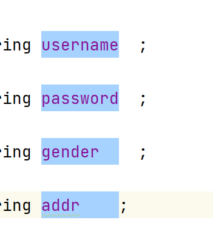
      - 也可实现同时写多行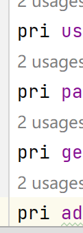

  - 在“com.demo.java”路径new一个测试类，

  - +②加载核心配置文件，获取SqlSessionFactory对象【官网copy

    - 因为mybatis-config.xml在resources路径下，所以可以直接写文件名

    - ```java
      //1.加载mybatis核心配置文件，获取SqlSessionFactory对象（从官网复制的
      String resource = "mybatis-config.xml";
      InputStream inputStream = Resources.getResourceAsStream(resource);
      SqlSessionFactory sqlSessionFactory = new SqlSessionFactoryBuilder().build(inputStream);
      ```

  - ③获取sqlSession对象（可用于执行sql语句

    - ```java
      SqlSession sqlSession=sqlSessionFactory.openSession();
      ```

  - ④执行sql语句

    - ***alt+enter自动引导，即等号及左边都是自动生成的*** 

    - ```java
      //3.执行sql语句         (alt+enter自动引导，即等号及左边都是自动生成的
      List<User> users = sqlSession.selectList("test.selectAll");
      ```

  - ⑤释放资源

    - ```
      //4.释放资源
      sqlSession.close();
      ```

-------------------------完整的测试类代码↓-----------

```java
/***
 * 测试类
 * mybatis快速入门
 */

public class MybatisDemo {
    public static void main(String []args)  throws IOException {
        //1.加载mybatis核心配置文件，获取SqlSessionFactory对象（从官网复制的
        String resource = "mybatis-config.xml";
        InputStream inputStream = Resources.getResourceAsStream(resource);
        SqlSessionFactory sqlSessionFactory = new SqlSessionFactoryBuilder().build(inputStream);
        //2.获取SqlSession对象(用它执行sql语句
        SqlSession sqlSession=sqlSessionFactory.openSession();
        //3.执行sql语句         (alt+enter自动引导，即等号及左边都是自动生成的
        List<User> users = sqlSession.selectList("test.selectAll");//test.selectAll可唯一标识
        System.out.println(users);
        //4.释放资源
        sqlSession.close();
    }
}
```

结果：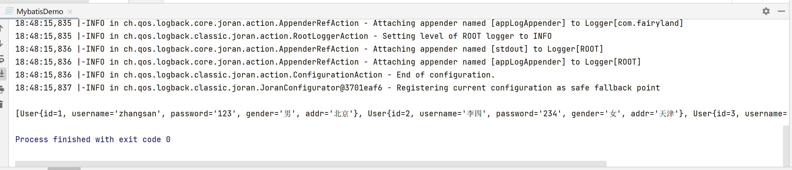


## 3.Mapper代理开发

引入：

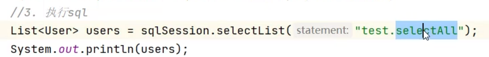

代码中还是有写死的地方("硬编码")，且需要切回xml文件看名字。

优化成method，直接用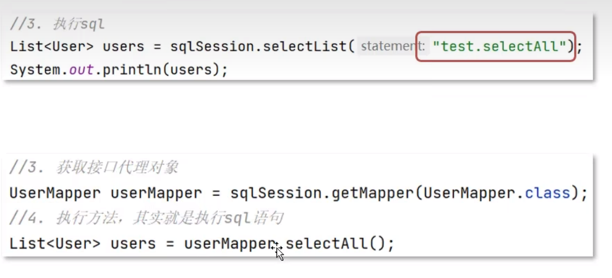


### tips1：target目录

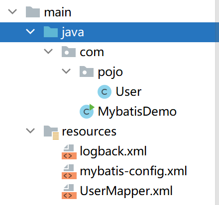

**<u>xml文件在resources目录下，</u>**编译(compile)后生成target文件夹，

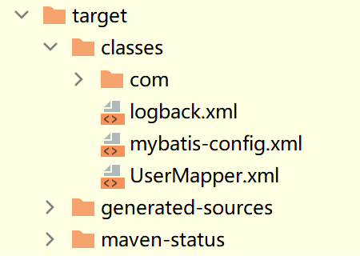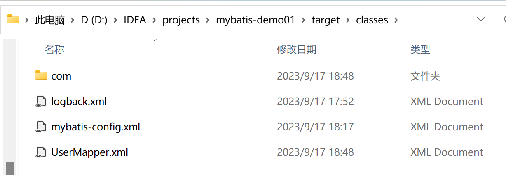

可知，在classes文件夹中，各配置xml和com包在一个目录下


### tips2：resourcs目录下建包

- 已知在java代码目录下建包belike：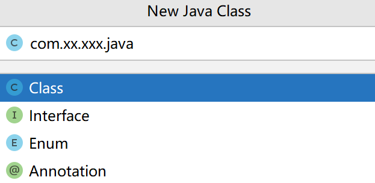


- 但在resouces目录下建包用“ `.` ”无法识别，<u>用“`/`”：</u>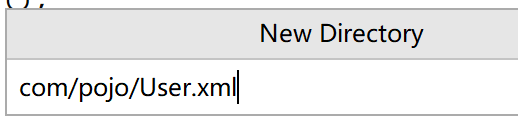
  - 结果：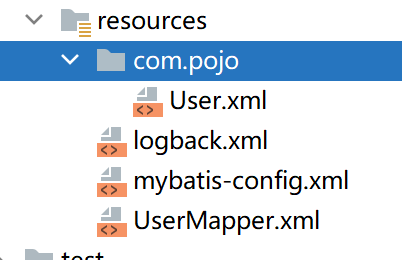
  - 重新编译后(需要对java代码改动才能重新compile)
    - 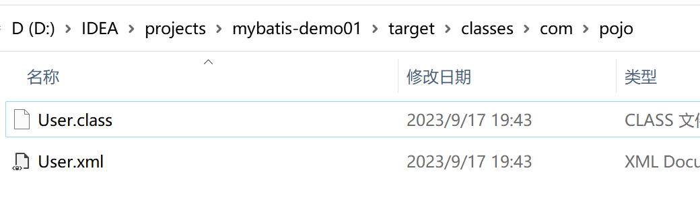
    - ***<u>通过在resous目录下建类的同名包-->把xml文件和java类放到了同一个目录中</u>***


### 步骤

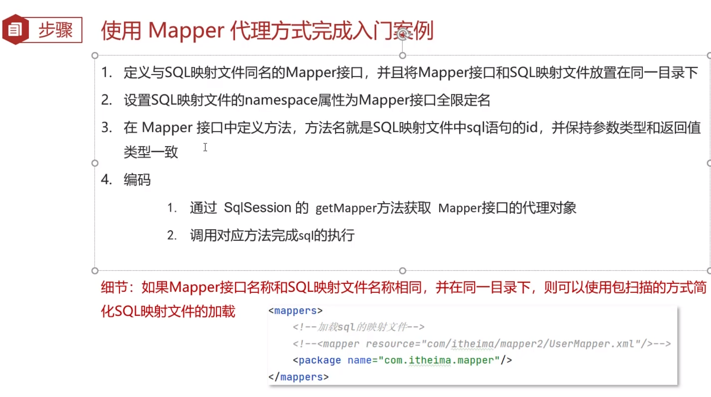

1. ①定义sql映射文件**同名**的Mapper**接口** (接口习惯上放在单独一个包里)

   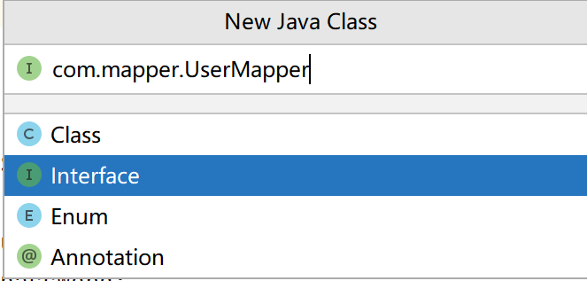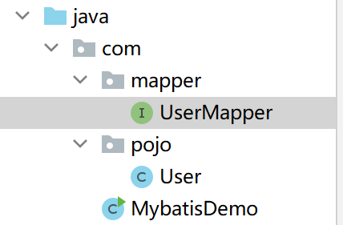

   

   ②用tips2的原理建一个包，把UserMapper.xml放进去-->实现了在同一目录下

   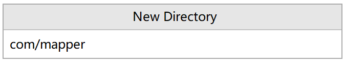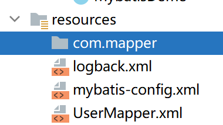

   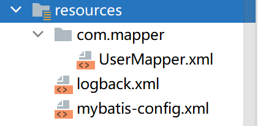

   编译后：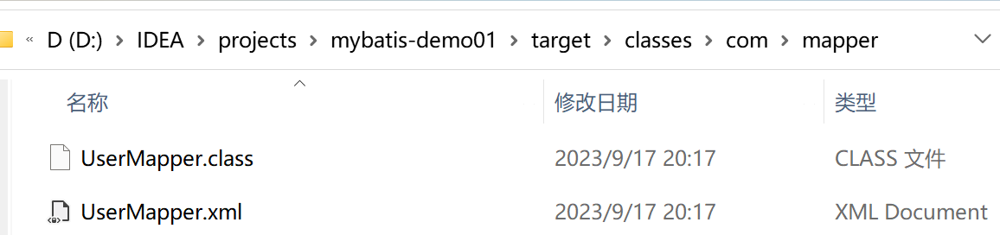

2. 把sql映射文件(UserMapper.xml文件)的namespace属性设置为 自己定义的mapper接口的全限定名

```xml
<mapper namespace="com.mapper.UserMapper">
```

3. 在mapper接口中定义方法（方法化），方法名=sql语句的id；返回值类型=resultType的类型；

   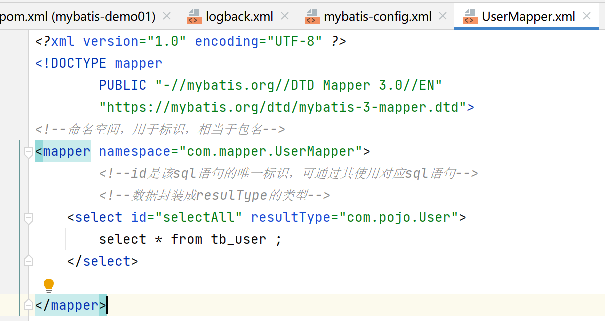

- 由UserMapper.xml可知，UserMapper接口应定义selectAll方法，返回值类型为User对象--` User selectAll();`

- 但是由sql语句可知：**查询的是所有用户，即返回多个user一个list**---》List<User>

  ```java
  List<User> selectAll();
  ```

ps.由于UserMapper.xml路径改到包底下了，mybatis-config.xml中加载它的路径需要修改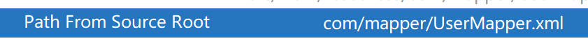


4.编码（写个测试类

前几步和入门案例一样，区别只在运行sql那段

```java
/***
 * 测试类
 * Mapper代理开发入门
 */

public class MybatisDemo2 {
    public static void main(String []args)  throws IOException {
        //1.加载mybatis核心配置文件，获取SqlSessionFactory对象（从官网复制的
        String resource = "mybatis-config.xml";
        InputStream inputStream = Resources.getResourceAsStream(resource);
        SqlSessionFactory sqlSessionFactory = new SqlSessionFactoryBuilder().build(inputStream);
        //2.获取SqlSession对象(用它执行sql语句
        SqlSession sqlSession=sqlSessionFactory.openSession();
        //3.执行sql语句         (alt+enter自动引导，即等号及左边都是自动生成的
        //List<User> users = sqlSession.selectList("test.selectAll");
        //3.1把UserMapper接口类型传进去，获取一个代理接口
        UserMapper userMapper = sqlSession.getMapper(UserMapper.class);
        //3.2通过代理接口调用方法
        List<User> users = userMapper.selectAll();
        System.out.println(users);
        //4.释放资源
        sqlSession.close();
    }
}
```


- 梳理思路:通过sqlSession对象的getMapper()获取一个UserMapper接口，而UserMapper接口的路径下有同名的sql映射文件(UserMapper.xml),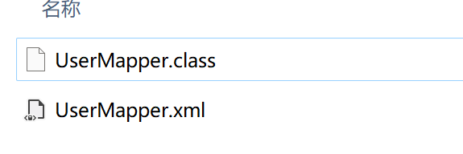
  - 通过该代理**接口调用方法**，而3.规定“<u>**方法名=sql语句的id**</u>”,即<u>通过方法能对应id同名的sql语句</u>，其实底层原理还是入门案例的那样


## 4.案例-配置文件实现CRUD

### 黑马官方note

[Mybatis：使用映射配置文件实现CRUD操作，能够使用注解实现CRUD操作_数据注解进行映射配置的方式_黑马程序员官方的博客-CSDN博客](https://blog.csdn.net/itcast_cn/article/details/123718088)

功能列表：

> - 查询
>   - 查询所有数据
>   - 查询详情
>   - 条件查询
> - 添加
> - 修改
>   - 修改全部字段
>   - 修改动态字段
> - 删除
>   - 删除一个
>   - 批量删除

### 4.1准备环境

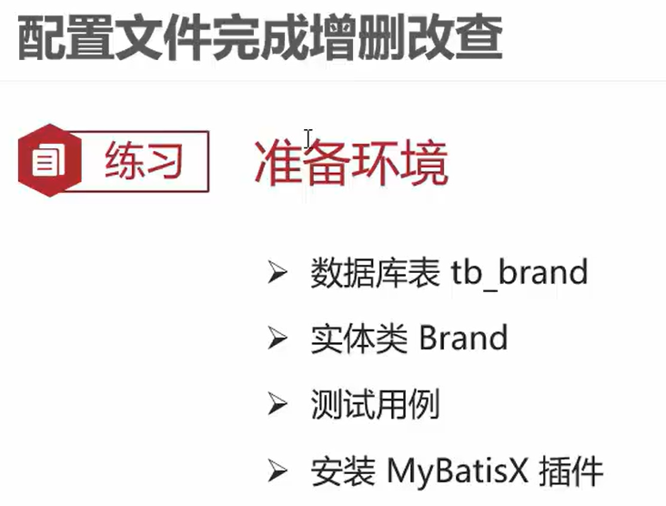

### 1.查询所有数据

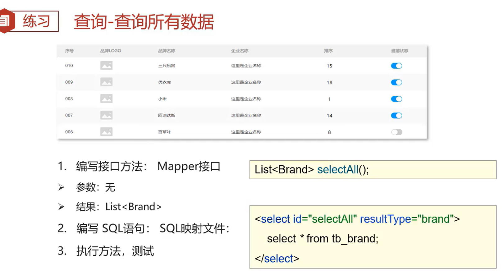

> 分析：
>
> - 参数：无(查所有)
> - 返回结果类型：List<Brand>(查所有品牌)
> - sql语句的编写：select * from xx


详细过程看官方note

- 对照着数据库表写实体类
- mybatisx能自动生成(alt+enter)statement即sql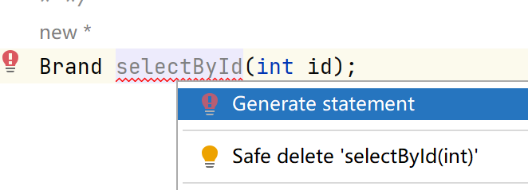

输出belike：

> [Brand{id=1, brandName='null', companyName='null', ordered=5, description='好吃不上火', status=0}, Brand{id=2, brandName='null', companyName='null', ordered=100, description='华为致力于把数字世界带入每个人、每个家庭、每个组织，构建万物互联的智能世界', status=1}, Brand{id=3, brandName='null', companyName='null', ordered=50, description='are you ok', status=1}]
>
> Process finished with exit code 0

- brandName='null', companyName='null',**没封装上**
  - 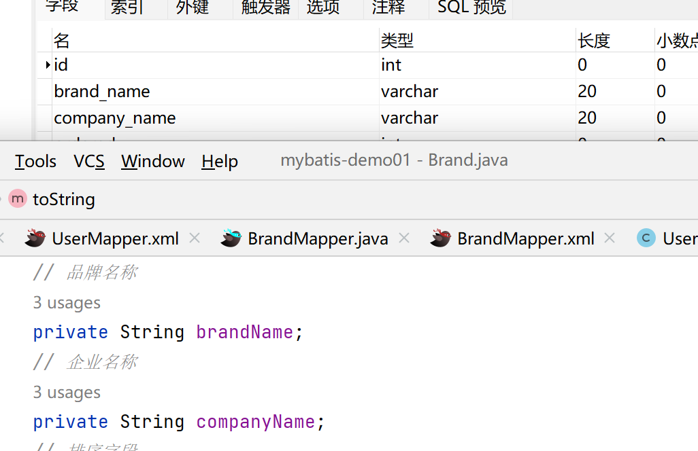
  - 因为db中表字段名和实体类中属性名不一样

*<u>solution：</u>*（两种

法一：

1. 我们可以在写sql语句时给这两个字段**起别名**，将别名定义成和属性名一致即可。

   <select id="selectAll" resultType="brand">
       select
       id, brand_name as brandName, company_name as companyName, ordered, description, status
       from tb_brand;
   </select
   
   
2. 因为写一长串字段，且每写一个< select>tag都要复制一次，很麻烦-----》把这段提取出来，用的时候引用

将需要复用的SQL片段抽取到 sql 标签中

```xml
<sql id="brand_column">
	id, brand_name as brandName, company_name as companyName, ordered, description, status
</sql>
```


id属性值是唯一标识，引用时也是通过该值进行引用。

在原sql语句中进行引用

使用 include 标签引用上述的 SQL 片段，而 refid 指定上述 SQL 片段的id值。

<select id="selectAll" resultType="brand">
    select
    <include refid="brand_column" />
    from tb_brand;
</select>


**<u>法二：</u>**

使用resultMap来定义字段和属性的映射关系

- id唯一标识，type映射类型

```xml
<resultMap id="brandResultMap" type="brand">
   
    <result column="brand_name" property="brandName"/>
    <result column="company_name" property="companyName"/>
</resultMap>

```

> ​		id：完成主键字段的映射
> ​                column：表的列名
> ​                property：实体类的属性名
> ​         result：完成一般字段的映射
> ​                column：表的列名
> ​                property：实体类的属性名
> 

SQL语句正常编写(**替换resultMap**属性成resultMap的id)

```xml
<select id="selectAll" resultMap="brandResultMap">
    select *
    from tb_brand;
</select>
```


### 2.查看详情（selectById

<u>mybatis提供了两种参数占位符：</u>

- **#{}** ：执行SQL时，会将 #{} 占位符替换为？，将来自动设置参数值。从上述例子可以看出使用#{} 底层使用的是 PreparedStatement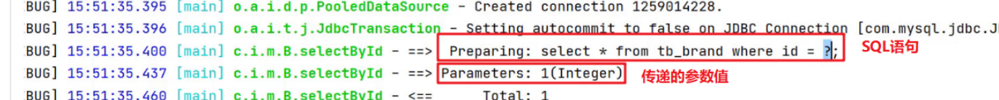

- **${}** ：拼接SQL。底层使用的是 Statement，会存在`SQL注入问题`。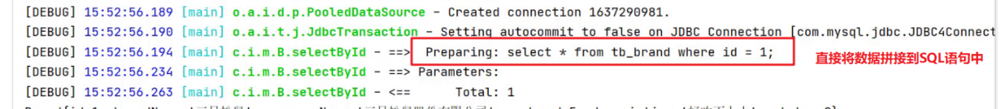
- 

<select id="selectById"  resultMap="brandResultMap">
    select *
    from tb_brand where id = #{id};
</select>

> ==注意：==从上面两个例子可以看出，以后开发我们使用 #{} 参数占位符。

<u>SQL语句中特殊字段处理</u>

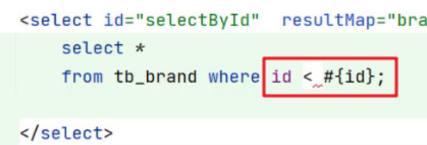

- 小于号
  - 转义字符			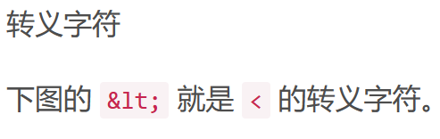
  - 打CD+alt+enter   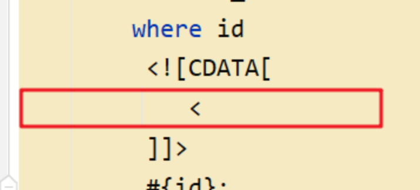

### 3.多条件查询

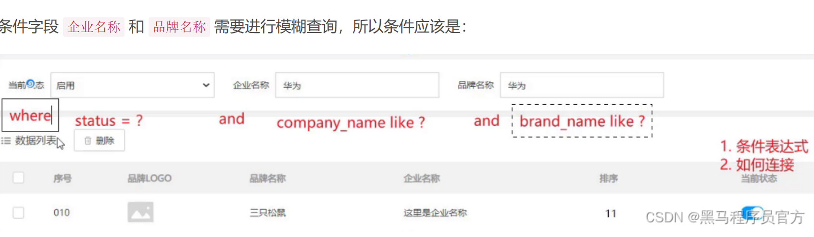

### 4.多条件，动态查询（多个条件，但是用户用了哪几个条件并不能确定）

- #### < if>标签  

-  `if test="status!=null"`判断参数是否有值

- 即在原来statement基础上加了if判断，，其他照旧

```xml
 <select id="selectByCondition" resultMap="brandResultMap">
        select * from tb_brand
        where status=#{status}
            and company_name like #{companyName}
            and brand_name like #{brandName}
    </select>
    <select id="selectByDynamiteConditionIf" resultMap="brandResultMap">
        select * from tb_brand
        where
        <if test="status!=null">
            status=#{status}
        </if>
        <if test="companyName!=null and companyName!=''">
            and company_name like #{companyName}
        </if>
        <if test="brandName!=null and brandName!=''">
            and brand_name like #{brandName}
        </if>
    </select>
```

- 但是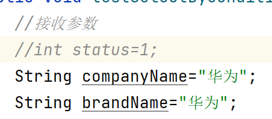当把某条件没写时（即不满足if)，因为设计问题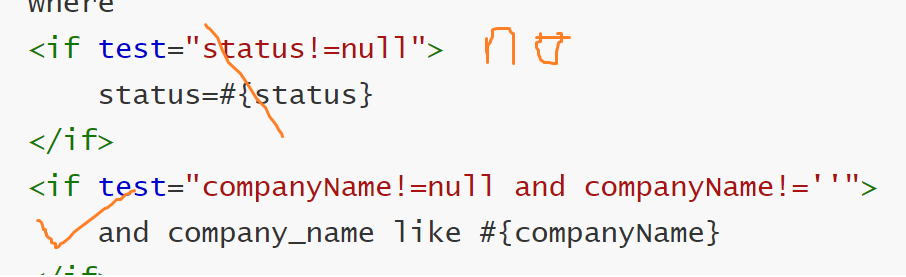
- 结果：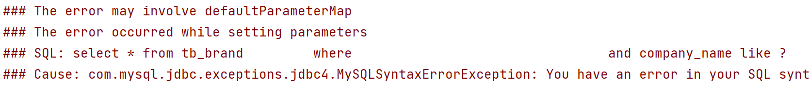where后直接+and+条件2了
  - **solution**：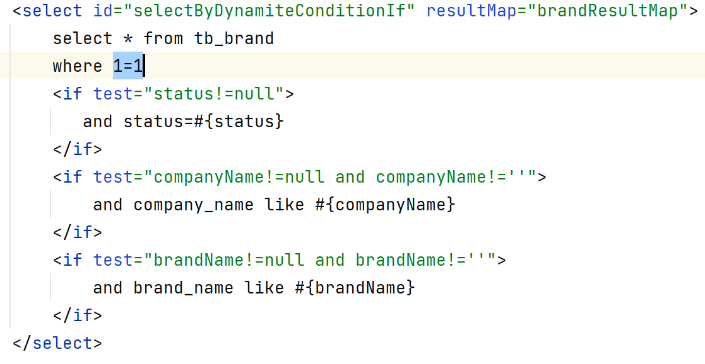
  - 利用永真的 **`1=1`** 使and即使怎样缺某个条件都合理了


#### < where>标签

- 解决了if标签中 and 的问题，替换where关键字（非常智能的一款tag

```xml
<select id="selectByDynamiteConditionIf" resultMap="brandResultMap">
        select * from tb_brand
        <!--where 1=1-->
        <where>
            <if test="status!=null">
               and status=#{status}
            </if>
            <if test="companyName!=null and companyName!=''">
                and company_name like #{companyName}
            </if>
            <if test="brandName!=null and brandName!=''">
                and brand_name like #{brandName}
            </if>
        </where>
    </select>
```


### 5.单条件，动态查询

< choose>相当于switch

<select id="selectByConditionSingle" resultMap="brandResultMap">
    select *
    from tb_brand
    <where>
        <choose><!--相当于switch-->
            <when test="status != null"><!--相当于case-->
                status = #{status}
            </when>
            <when test="companyName != null and companyName != '' "><!--相当于case-->
                company_name like #{companyName}
            </when>
            <when test="brandName != null and brandName != ''"><!--相当于case-->
                brand_name like #{brandName}
            </when>
        </choose>
    </where>
</select>
