# [Spring Framework Tutorial | Full Course - YouTube](https://www.youtube.com/watch?v=If1Lw4pLLEo)

## 1.报错集：

1.

一开始class属性爆红，cannot resolve class or package ppr和cannot resolve class Car

solution:一开始用的ppr.Car当，因为建包的时候右键new没有package

- 在蓝色文件夹(Sources Root)右键就可以建包了

2.

solution:

**因为在 Idea 中，编译器只会把 src/main/java 也就是源代码目录下的 <u>.java</u> 文件编译成 .class 文件然后放到 target 目录中，其他的默认不会。**

- 把spring.xml复制一份放到target/classes目录下


3.

solution:可以看出我写错地方了(classes\spring.xml)，写在”java\spring.xml“就解决了


4.

solution：漏了对括号


## 2.codes

### 1.Dependency injection


```xml
    <dependency>
      <groupId>org.springframework</groupId>
      <artifactId>spring-context</artifactId>
      <version>4.2.4.RELEASE</version>
    </dependency>
    ---------------pom.xml-------------------
    --------------spring.xml--------------------
        <bean id="vehicle" class="com.ppr.Car"></bean>
```

```java
package com.ppr;

public interface Vehicle {
    public void drive();
}

```

```java
package com.ppr;

public class Car implements Vehicle{
    @Override
    public void drive() {
        System.out.println("car is running");
    }
}

```

```java
package com.ppr;

import org.springframework.context.ApplicationContext;
import org.springframework.context.support.ClassPathXmlApplicationContext;

public class App {
    public static void main(String[]args){
        ApplicationContext context= new ClassPathXmlApplicationContext("spring.xml");
       Vehicle vehicle=(Vehicle) context.getBean("vehicle");
       vehicle.drive();
    }
}

```


- `ApplicationContext context= new ClassPathXmlApplicationContext("spring.xml");`
         `Vehicle vehicle=(Vehicle) context.getBean("vehicle");`//objext->Vehicle

- **过去想用别的接口实现类得在main方法里改，耦合高＋得重新编译测试。现在只需在pring.xml文档中`class="com.ppr.Car“`,把Car改成其他实现类即可。**

### 2.< property>属性/成员（Setter injection

```java
public class Tyre {
    private String brand;//成员/属性
    @Override
    public String toString() {
        return "Tyre{" +
                "brand='" + brand + '\'' +
                '}';
    }
}

```

```xml
<bean id="tyre" class="com.ppr.Tyre">
        <property name="brand" value="test"></property>
    </bean>
```

- **相当于setter**

### 3.constructor injection

- < constructor-arg>

```java
 public Tyre() {//无参构造

    } 
public Tyre(String brand) {//加了构造器
        this.brand = brand;
    }
```

```xml
<bean id="tyre" class="com.ppr.Tyre">
        <constructor-arg value="aaa"></constructor-arg>
 </bean>
```

### 4.Annotation|configuration| Bean

---------------------------E.G.1---------------------------------------

```java
public class Samsung {
    public void config(){
        System.out.println("samsung--config--method--");
    }
}
```

```java
public class App //主方法
{
    public static void main( String[] args )
    {
        ApplicationContext factory= new AnnotationConfigApplicationContext(AppConfig.class);
        Samsung s1=factory.getBean(Samsung.class);
        s1.config();
    }
}
```

```java
@Configuration
public class AppConfig {
    @Bean
    public Samsung setSamsung(){
        return new Samsung();
    }

}
```


- ```
  ApplicationContext factory= new AnnotationConfigApplicationContext(AppConfig.class);
   Samsung s1=factory.getBean(Samsung.class);
  ```

  - AppConfig是配置类，**@Configuration**,相当于xml配置文件
  - @Bean，表示一个bean,相当于< bean/>


-------------------------------E.G.2----自动连线/装载（**@Autowired**)------------------------------------------

```jade
public class Samsung {
   
    private Processor cpu;//属性

    public Processor getCpu() {
        return cpu;
    }
    public void setCpu(Processor cpu) {
        this.cpu = cpu;
    }

    public void config(){
        System.out.println("samsung--config--method--");
        cpu.run();
    }
}
```

```java
@Configuration
public class AppConfig {
    @Bean
    public Samsung setSamsung(){
        return new Samsung();
    }

    @Bean
    public Processor getCpu (){
        return new BestProcessor();
    }

}
```

```java
public interface Processor {//处理器接口
    public void run();
}
```

```java
public class BestProcessor implements Processor{
//接口实现类
    @Override
    public void run() {
        System.out.println("^^i am best cpu~~");
    }
}
```


- 由报错可知：AppConfig类的getCpu()并没能把new的对象给传过去。
- - <u>***@Autowired**</u>*

- 


### 5. Annotation|Component

可以在config类中不写具体的Bean

- config类+注解：

  - `@ComponentScan(basePackages = "org.example")`

- bean对应的类上面加注解：`@Component`

  - 默认bean id为类名+第一个字母小写
  - 自定义bean id: Component("xxx")

  ```java
  @Configuration
  @ComponentScan(basePackages = "org.example")
  public class AppConfig {
     /* @Bean
      public Samsung setSamsung(){
          return new Samsung();
      }
  
      @Bean
      public Processor getCpu (){
          return new BestProcessor();
      }
  */
  }
  ```

```java
@Component
public class Samsung {。。。。。。}
```

```java
@Component
public class BestProcessor implements Processor{
    。。。}
```

### 6.Annotation|Primary &Qualifier

- 如果在5.的code基础上加一个Processor接口实现类SecondProcessor

- ```java
  @Component
  public class SecondProcessor implements Processor{
      @Override
      public void run() {
          System.out.println("&&2nd CPU**");
      }
  }
  ```

报错：Caused by: org.springframework.beans.factory.NoUniqueBeanDefinitionException: No qualifying bean of type 'org.example.Processor' available: expected single matching bean but found 2: bestProcessor,secondProcessor

- <u>**solution1：@Primary**</u>
- - 指明两个实现类谁的优先级更高，即new该类的bean
  - 使用与 `@Primary` 注释关联的 **bean** 。
  - 


- **<u>solution2：@Qualifier("bean的id")</u>**
  - 自动装配(@Autowired)的时候
  - 
  - ps：一开始写的SecondP...报错，改小写(默认bean的id)就ok了
  - 


# leifengyang-Spring

# IOC

- ApplicationContext是IOC容器接口
- 容器中的对象在**容器创建好之后**就创建了（比getBean的时候早
- Bean的属性名由setter决定（去掉set后首字母小写

- < proverty>--setter;< constructor-arg>--构造器（该构造器有几个写几个< constructor-arg>

------


@Autowired（自动装配）

- 先按**类型**去**容器中找对应类型**的组件

  - 找到--赋值

  - 没找到--抛异常

  - 找到多个
    - 按**变量名用作id**再找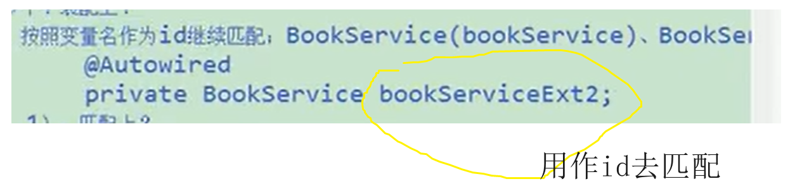
      - 匹配上--装配
      - 没匹配上--报错
    - Qualifier("xx")**指定一个名当id**去装配，而不是之前的变量名当id
      - 找到--装配
      - 找不到--报错

- Autowired(**required=false**)找不到就null，避免报错


方法上有@Autowired

1.这个方法在bean创建得时候自动运行

2.这个方法上每个参数都自动注入值

--------------------------------------------

@Autowired，@Resource，@Injection都是自动装配

- @Resource：javaee自带，java标准--》扩展性强：如果换成别的容器框架也能用它
- @Autowired：spring框架的注解

--------------------------------------------------

Spring单元测试

@ContextConfiguration（locations="")指定spring的配置文件的位置

@RunWith(SpringJUnitClassRunner.class)指定用spring单元测试驱动来测试，以前默认是junit

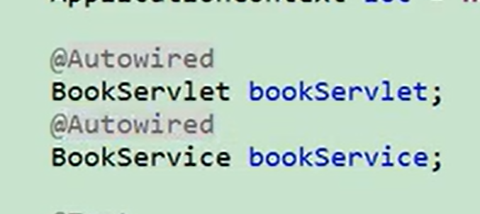

不用再麻烦地getBean()来获取对象，可以在测试中使用自动装配

------------------------

泛型依赖注入：

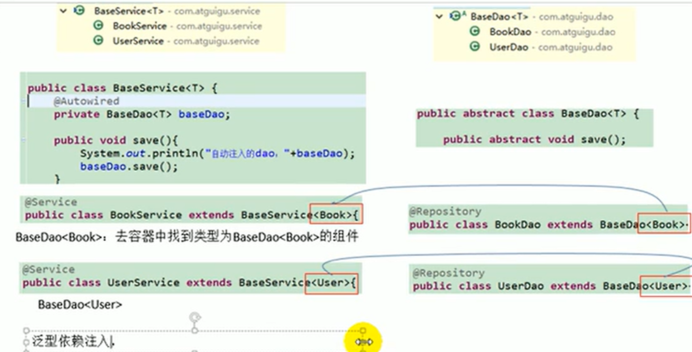

- 有Bookservice,Userservice两个bean（因为他俩都继承baseServlet<>相当于把里面代码复制粘贴过去
- --》在baseServlet<>写的@Autowired能正常运作
- @Autowired在上一行，--》自动装载了BaseDao< Book>对象，BaseDao< User>
  - 去容器中按**类型**查找，即按BaseDao< Book>和BaseDao< User>分别查找，能匹配上唯一一个对象

---------

- ioc是个容器，帮忙管理所有组件（@service等
- 某个组件要想使用spring提供的更多功能（ioc，aop），则必须加入容器中
- 容器底层其实是个map
- 源码调试思路：关键步骤**打断点**，进去看每一步具体咋执行

------------

# AOP

### 	动态代理

- 比如一些日志记录，直接写在方法内部----》不推荐，维护修改麻烦
  - 日志记录：系统辅助功能
  - 业务逻辑：核心功能
  - 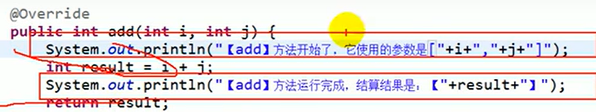二者耦合
- 目标：日志模块在核心功能运行时自己**动态**地加上

----》拿到代理对象，通过代理对象调用原来的方法。

缺点：jdk默认的动态代理，若目标对象未实现任何接口，则无法生成代理类

- **代理对象和目标对象唯一产生关联的地方：都实现了同样的接口**

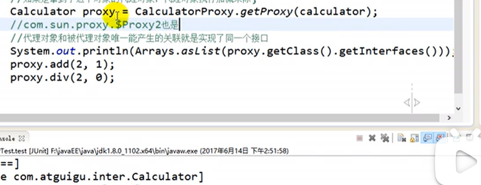

----------------

Spring实现AOP功能，**底层就是动态代理**，比动态代理简化。

### 1.AOP术语

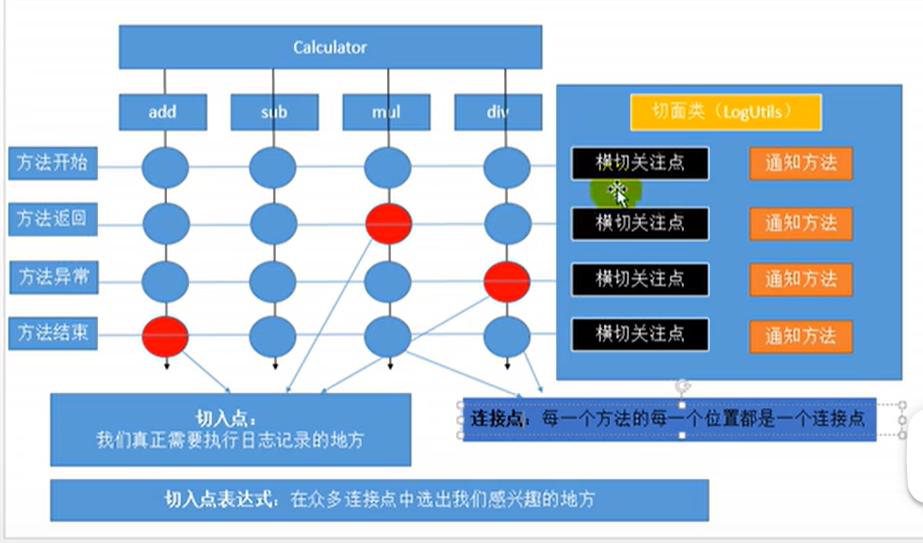

- 通知方法--日志记录的方法
- 切面类--通知方法所在的类
- 连接点--原来的功能类可以写日志记录的地方
- 切入点--连接点中真正用了的地方
- 切入点表达式--表明在连接点中用了哪些切入点

### 2。写配置

1）将目标类和切面类加入ioc容器中（如@Service，@Component

2）告诉spring哪个类是切面类（@Aspect

3）告诉spring切面类中的通知方法都是什么时候运行

- @Before（切入表达式）                 目标方法之前运行
- @After（切入表达式）                     目标方法结束之后
- @AfterReturning（切入表达式）    目标方法正常返回之后
- @AfterThrowing （切入表达式）    目标方法异常之后
- 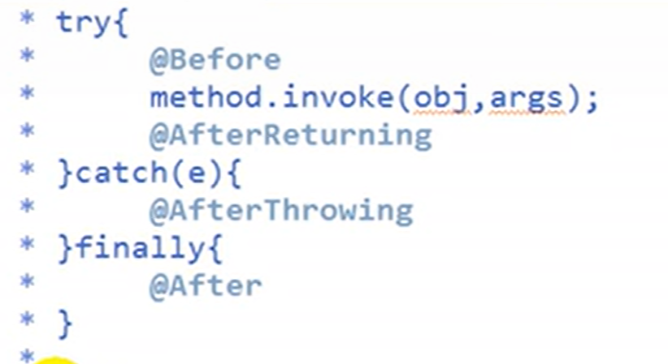
- 切入表达式
  - "execution(public int 目标方法的全类名)"

### 3.测试

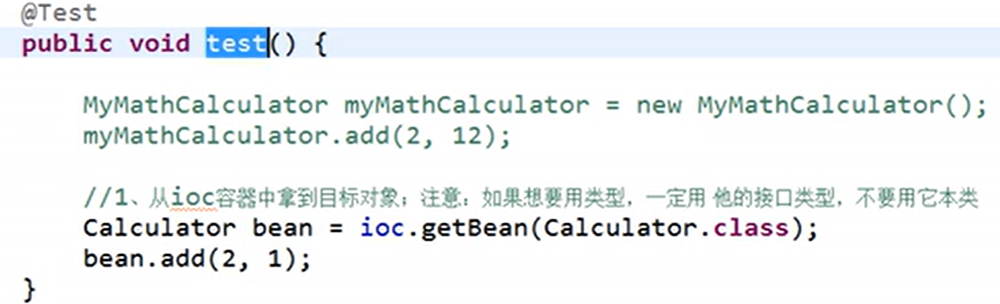

- 从ioc容器中拿对象，如果按类型，**用接口类型**，不能用本类

---

### 细节

细节一：

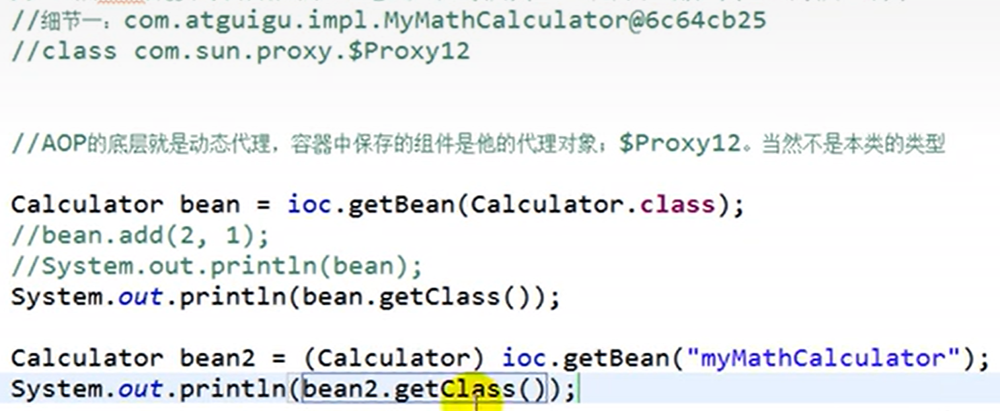

如果把切面类的注解@Aspect删掉，即没切入了，则bean还是苯类对象；但实现aop后就是动态代理对象。


细节七：  抽取可重用的切入点表达式（防止同样的切入点表达式，却不得不修改多处

1. 写一个无返回值的方法
2. 把重用的切入点表达式写入@Pointcut注解，原通知的切入点表达式处改为1.中的方法名()

```java
public class logUtis {
    @Pointcut("execution(public int com.calculator.impl.MyCal.*(int,int))")///
    public void chongyong(){}///

    @Before("chongyong()")///
    public static void logStart(){
        System.out.println("xx方法开始执行");
    }
    @After("chongyong()")///
    public static void logEnd(){
        System.out.println("xx方法结束");
    }
```


细节八：  环绕通知**@Around**

- 相当于Before,After,AfterThrowing,,AfterReturning四合一

- **通过反射调用目标方法**

- > @Around能决定目标方法晕不晕行；但其他四个不能；--》比如做权限验证时，验证不过就不运行-->用@Around
  >
  > 无需牵扯目标方法的场景->用其他四个

- 有参数ProceedingJoinPiont pjp

  - 是JoinPoint的子接口之一
  - Object[] **getArgs()**：获取连接点的参数数组。
  - Object **proceed(Object[] args)**：可以使用proceed()方法来控制目标方法的执行。当我们调用proceed()方法时，它会触发**目标方法的执行**，并返回目标方法的返回值（如果有）

- 相当于如图的动态代理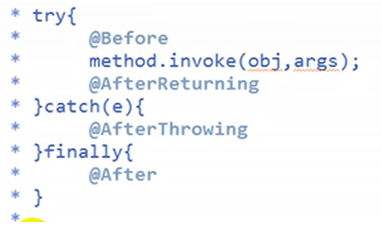

```java
 @Pointcut("execution(public int com.calculator.impl.MyCal.*(int,int))")
    public void chongyong(){}

    @Around("chongyong()")
    public Object myAround(ProceedingJoinPoint pjp) throws Throwable {
        Object[] args = pjp.getArgs();//获取目标方法参数
        String name=pjp.getSignature().getName();//获取方法签名对象，通过签名对象获取方法名
        Object proceed = null;
        try{
            //@Before
            System.out.println(name+"xx方法开始执行");
            proceed=pjp.proceed(args);//相当于目标方法的执行语句
            //@AfterReturning
            System.out.println(name+"xx方法正常返回");

        }catch(Exception e){
            //@AfterThrowing
            System.out.println(name+"xx方法异常:"+e);
        }finally{
            //@After()
            System.out.println(name+"xx方法结束");
        }

        return proceed;
    }
```

结果：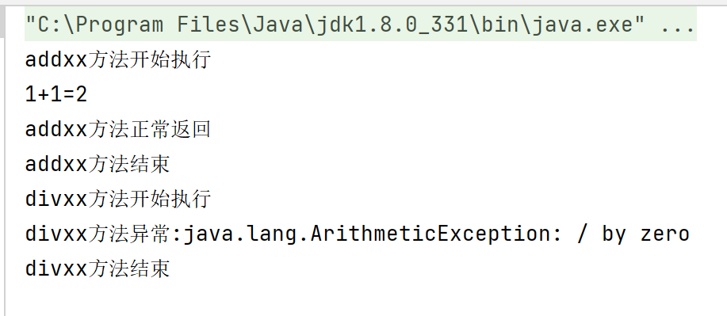


细节十： 多个切面执行顺序

> add方法开始执行
> [validate]add方法开始执行
> [validate]add方法正常返回,结果是2
> [validate]add方法结束
> add方法正常返回,结果是2
> add方法结束

- 依据：切面类首字母大小写
- 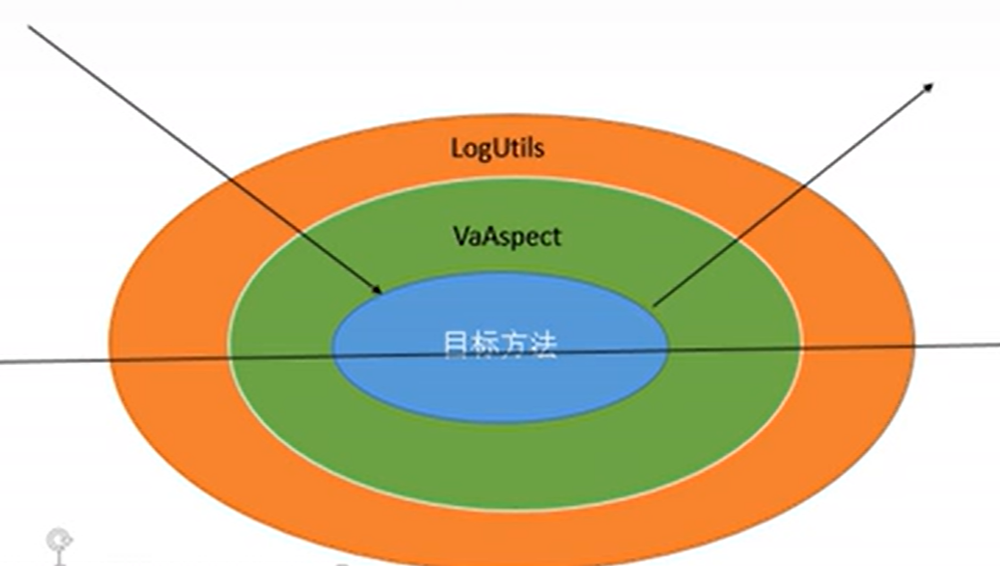


### codes

#### 案例1：计算器+日志（aop实现）

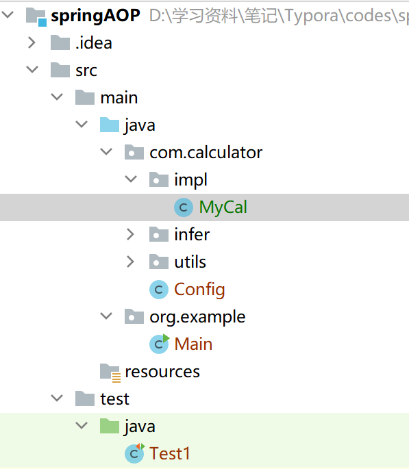

Calculator接口

```java
package com.calculator.infer;
import org.springframework.stereotype.Component;

public interface Calculator {
    public int add(int i,int j);
    public int minus(int i,int j);
    public int mul(int i,int j);
    public int div(int i,int j);

}
```

MyCal实现类

```java
package com.calculator.impl;

import com.calculator.infer.Calculator;
import org.springframework.stereotype.Service;

@Service
public class MyCal implements Calculator {
    @Override
    public int add(int i, int j) {
        int result=i+j;
        System.out.println(i+"+"+j+"="+result);
        return result;
    }

    @Override
    public int minus(int i, int j) {
        return i-j;
    }

    @Override
    public int mul(int i, int j) {
        return i*j;
    }

    @Override
    public int div(int i, int j) {
        return i/j;
    }
}
```

Config配置类

```java
package com.calculator;

import org.springframework.context.annotation.ComponentScan;
import org.springframework.context.annotation.ComponentScans;
import org.springframework.context.annotation.Configuration;

@Configuration
@ComponentScan(basePackages ="com.calculator")
public class Config {

}

```

logUtils切面类--添加日志

```java
package com.calculator.utils;

import org.aspectj.lang.annotation.*;
import org.springframework.context.annotation.EnableAspectJAutoProxy;
import org.springframework.stereotype.Component;
@Aspect
@EnableAspectJAutoProxy // 启用Spring的AOP功能*****
@Component
public class logUtis {

    @Before("execution(public int com.calculator.impl.MyCal.*(int,int))")
    public static void logStart(){
        System.out.println("xx方法开始执行");
    }
    @After("execution(public int com.calculator.impl.MyCal.*(int,int))")
    public static void logEnd(){
        System.out.println("xx方法结束");
    }
    @AfterReturning("execution(public int com.calculator.impl.MyCal.*(int,int))")
    public static void logReturn(){
        System.out.println("xx方法正常返回");
    }
    @AfterThrowing(value="execution(public int com.calculator.impl.MyCal.*(int,int))",throwing="exception")
    public static void logException(Exception exception){
        System.out.println("xx方法异常:"+exception);
    }
}

```

依赖

```xml
<dependencies>
        <dependency>
            <groupId>org.springframework</groupId>
            <artifactId>spring-context</artifactId>
            <version>5.3.18</version>
        </dependency>

        <dependency>
            <groupId>junit</groupId>
            <artifactId>junit</artifactId>
            <version>4.11</version>
            <scope>test</scope>
        </dependency>
        <dependency>
            <groupId>org.aspectj</groupId>
            <artifactId>aspectjweaver</artifactId>
            <version>1.9.9.1</version>
        </dependency>

        <dependency>
            <groupId>org.springframework</groupId>
            <artifactId>spring-aspects</artifactId>
            <version>5.3.19</version>
        </dependency>

    </dependencies>
```

测试类

```java
import com.calculator.Config;
import com.calculator.infer.Calculator;
import org.junit.Test;
import org.springframework.context.ApplicationContext;
import org.springframework.context.annotation.AnnotationConfigApplicationContext;
import org.springframework.context.support.ClassPathXmlApplicationContext;

public class Test1 {
    ApplicationContext ioc= new AnnotationConfigApplicationContext(Config.class);
    /*AnnotationConfigApplicationContext构造函数中传入的参数应该是配置类的类对象，
      而不是配置类的名称。所以您需要将"Config.class"修改为Config.class。*/
    @Test
    public void test(){
       Calculator bean= ioc.getBean(Calculator.class);//动态代理与接口实现类的唯一联系就是实现的接口，不能获取本类
       bean.add(1,1);
       bean.div(3,0);
    }
}

```

结果：

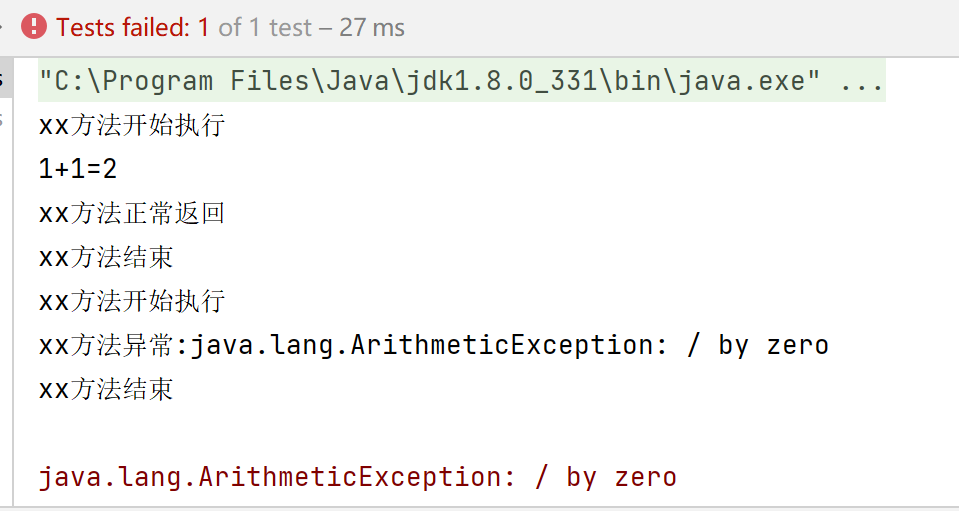

- 之前在test方法写了print语句，结果最后打印，我以为带上add()方法就会被日志方法夹在中间。其实只有在add方法体内写才还会有这种效果。chat道：`至于最后一行的"1+1=2"是您自己添加的输出语句，并不是切面逻辑产生的结果。`

---

Aop使用场景

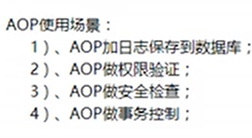

- 事务belike，异常-回滚，结束-关闭资源，返回 开始-提交

- > @Around能决定目标方法晕不晕行；但其他四个不能；--》比如做权限验证时，验证不过就不运行-->用@Around
  >
  > 无需牵扯目标方法的场景->用其他四个


#### xml配置版

配置：

1. 加入ioc容器（bean tag

```xml
  	<bean id="myCal" class="com.calculator.impl.MyCal"></bean>
    <bean id="logUtis" class="com.calculator.utils.logUtis"></bean>
    <bean id="validateAspect" class="com.calculator.utils.validateAspect"></bean>
```

2.告诉spring有哪些切面

```xml
   <aop:config>   
        <!--指定切面-@Aspect-->
        <aop:aspect ref="logUtis">
        </aop:aspect>

        <aop:aspect ref="validateAspect">    
        </aop:aspect>
    </aop:config>
```


3.before，after之类的执行位置

```xml
<aop:config>
        <aop:pointcut id="globalpoint" expression="execution(int com.calculator.impl.MyCal.*(int,int))"/>
        <!--指定切面-@Aspect-->
        <aop:aspect ref="logUtis">
            <aop:pointcut id="mypointcut" expression="execution(int com.calculator.impl.MyCal.*(int,int))"/><!--切面表达式，免得复制粘贴好几行-->
            <aop:before method="logStart" pointcut-ref="mypointcut"></aop:before>
            <aop:after method="logEnd" pointcut="execution(int com.calculator.impl.MyCal.*(int,int))"></aop:after>
            <aop:after-throwing method="logException" pointcut-ref="mypointcut" throwing="exception"></aop:after-throwing>
            <aop:after-returning method="logReturn" pointcut-ref="mypointcut" returning="result"></aop:after-returning>
        </aop:aspect>

        <aop:aspect ref="validateAspect">
            <aop:before method="logStart" pointcut-ref="globalpoint"></aop:before>
            <aop:after method="logEnd" pointcut-ref="globalpoint"></aop:after>
            <aop:after-throwing method="logException" pointcut-ref="globalpoint" throwing="exception"></aop:after-throwing>
            <aop:after-returning method="logReturn" pointcut-ref="globalpoint" returning="result"></aop:after-returning>
        </aop:aspect>
    </aop:config>
```

